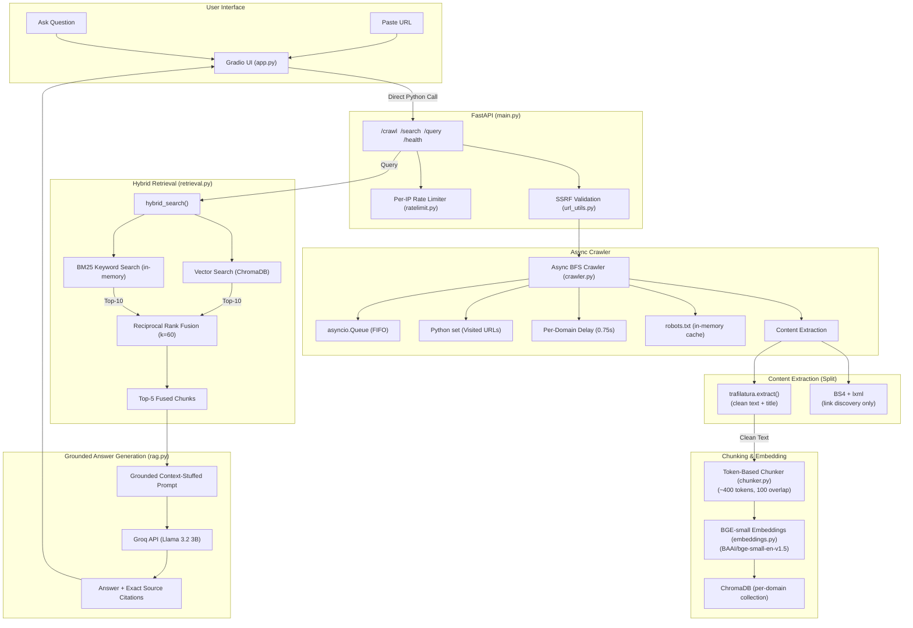

# Web Crawler + Hybrid RAG Search Engine — Implementation Plan

> An on-demand documentation crawler and hybrid-retrieval search engine.
> Paste any documentation URL, the system crawls it asynchronously, chunks and
> embeds the text into ChromaDB, and lets you ask questions with citation-grounded
> answers powered by Groq LLM.
>
> **Based on the Final Build Spec (No-Redis).**

---

## Architecture Overview



---

## Tech Stack

| Component | Choice | Why |
|---|---|---|
| Language | Python 3.11+ | Native async I/O, ML ecosystem |
| HTTP Client | `httpx` (async) | Async-native, non-blocking requests |
| Content Extraction | `trafilatura` | Boilerplate-free, tuned against real-world sites |
| Link Discovery | `BeautifulSoup4` + `lxml` | Walking `<a href>` tags (separate from content extraction) |
| Queue & State | `asyncio.Queue` + `set()` | In-memory single-worker state, zero infrastructure |
| Embeddings | `sentence-transformers` / `BAAI/bge-small-en-v1.5` | 512-token limit, strong retrieval quality |
| Vector DB | ChromaDB (local persistent) | Fast local embedded storage, per-domain isolation |
| Keyword Search | `rank_bm25` | In-memory lexical search for exact identifiers |
| Rank Fusion | Reciprocal Rank Fusion (RRF, k=60) | Parameter-free fusion of vector & BM25 rankings |
| LLM | Groq API (`llama-3.2-3b-preview`) | Ultra-fast inference, free tier, open weights |
| API | FastAPI | Real curl-testable endpoints, auto-docs |
| UI | Gradio (mounted in FastAPI) | Clean interactive UI, one process to deploy |
| Deployment | Render (single service) | No separate Redis/Upstash needed |

---

## Project Structure

```text
web_crawler/
├── config.py                # All tunables in one place
├── url_utils.py             # URL normalization, domain checks, SSRF validation
├── content_extractor.py     # trafilatura wrapper + BS4 link discovery
├── crawler.py               # Async BFS loop, robots.txt, politeness, HTTP retries
├── chunker.py               # Paragraph-aware TOKEN-based chunker (model tokenizer)
├── embeddings.py            # BGE-small singleton, ChromaDB upsert/management
├── retrieval.py             # Vector search + BM25 + Reciprocal Rank Fusion
├── rag.py                   # Grounded prompt + Groq LLM call
├── ratelimit.py             # In-memory per-IP sliding-window rate limiter
├── main.py                  # FastAPI app: /health /search /query /crawl
├── app.py                   # Gradio UI (2 tabs), mounted into main.py
├── eval/
│   ├── queries.json         # 10 test queries with expected source URLs
│   └── run_eval.py          # Hit@3 + MRR, vector-only vs hybrid comparison
├── test_crawler.py          # Verification tests for url_utils + crawler + SSRF
├── test_chunker.py          # Verification tests for token-based chunker
├── requirements.txt         # Dependencies
├── README.md                # Project docs (write yourself)
└── chroma_data/             # Persistent ChromaDB storage directory
```

---

## Phase Breakdown

---

### ✅ Phase 0 — Scaffolding (DONE — needs patch)

**What's done:** `requirements.txt` exists, venv is set up, core deps installed.

**Patch needed:**
- Add missing dependencies: `trafilatura`, `fastapi`, `uvicorn`
- Verify `GROQ_API_KEY` is set and can make a test call to Groq
- Verify ChromaDB opens and embedding model loads

---

### ✅ Phase 1 — SSRF Validation (DONE)

- `is_public_url()` in `url_utils.py` — rejects non-http(s) schemes, resolves DNS, blocks private/loopback/link-local IPs via `ipaddress.is_global`
- Wired as a guard in `crawler.crawl()` before any network fetch
- Tested with `169.254.169.254`, `10.0.0.5`, `localhost`, `file:///etc/passwd`

---

### 🔄 Phase 2 — Crawler Patch: `trafilatura` + Safety Limits (NEEDS CHANGES)

**What's done:** Async BFS crawl loop, robots.txt, politeness, retries all work.

**Changes needed:**

#### [NEW] `content_extractor.py`
- Replace our BS4 multi-tier heuristic (`extractor.py`) with a `trafilatura` wrapper
- `extract_text(html)` → calls `trafilatura.extract(html, include_links=False)` for clean text
- `extract_title(html)` → calls `trafilatura.extract_metadata(html).title` for page title
- `extract_links(html)` → BS4 `<a href>` discovery (kept from current `extractor.py`)

#### [MODIFY] `crawler.py`
- Import from `content_extractor` instead of `extractor`
- Add **response-size cap** (~2MB) — skip pages with `Content-Length > 2MB`
- Add **per-page timeout** — wrap `fetch_page()` in `asyncio.wait_for(..., timeout=10)`
- Add **session deadline** (~150s) — check `time.monotonic()` each loop iteration, hard stop

#### [DELETE] `extractor.py`
- Replaced by `content_extractor.py`

#### [MODIFY] `config.py`
- Add `MAX_RESPONSE_SIZE = 2 * 1024 * 1024` (2MB)
- Add `CRAWL_SESSION_TIMEOUT = 150` (2.5 min hard deadline)

---

### ✅ Phase 3 — Token-Based Chunking (DONE)

- `chunker.py` uses `AutoTokenizer.from_pretrained("BAAI/bge-small-en-v1.5")`
- Exact token counts, all chunks verified ≤ 512 tokens
- Paragraph-aware splitting with sentence-boundary fallback
- `config.py` updated: `CHUNK_SIZE=400` and `CHUNK_OVERLAP=100` are tokens, not words

---

### ⏳ Phase 4 — Embeddings + ChromaDB Storage

- **`embeddings.py`**:
  - Singleton model loader for `BAAI/bge-small-en-v1.5`
  - Per-domain collection naming (`domain_<md5_hash>`)
  - Deterministic chunk IDs (`md5(f"{url}::{chunk_index}")`) for idempotent upserts
  - Re-crawling the same URL upserts (not duplicates)

---

### ⏳ Phase 5 — Hybrid Retrieval + RRF

- **`retrieval.py`**:
  - `vector_search(query, collection, top_k=10)` via ChromaDB
  - `BM25Index` class built from `collection.get()`, cached per domain
  - Cache invalidation when new crawl adds chunks to a domain
  - `reciprocal_rank_fusion(ranked_lists, k=60, top_n=5)`
  - **Rewrite RRF by hand** after seeing the generated code

---

### ⏳ Phase 6 — Grounded Answer Generation (Groq)

- **`rag.py`**:
  - Context-stuffed prompt: answer only from context, cite `[Source: URL]`
  - Explicit "I don't have enough information" when context doesn't cover the question
  - Groq API call with retry-with-backoff on HTTP 429
  - Latency tracking: `vector_ms`, `bm25_ms`, `fusion_ms`, `llm_ms`, `total_ms`

---

### ⏳ Phase 7 — FastAPI App + Rate Limiting

- **`main.py`**:
  - `GET /health` → `{"status": "ok", "groq": bool, "collections": [...]}`
  - `POST /crawl` → SSRF check → rate limit → blocking crawl → page/chunk counts
  - `POST /search` → hybrid retrieval, returns fused chunks + latency
  - `POST /query` → retrieval + Groq answer + sources + latency
- **`ratelimit.py`**:
  - In-memory per-IP sliding window (`deque` of timestamps)
  - Cap at 3 crawl-triggers/hour per IP

---

### ⏳ Phase 8 — Gradio UI (2 Tabs)

- **`app.py`** mounted into `main.py` via `gr.mount_gradio_app(app, demo)`
- Gradio calls underlying Python functions directly (not HTTP to itself)
- **Tab 1 — Crawl & Ingest:** URL input, preset "known good" buttons, spinner, page/chunk counts
- **Tab 2 — Search & Ask:** Domain selector, query box, Search/Ask toggle, markdown results + latency

---

### ⏳ Phase 9 — Retrieval Evaluation

- **`eval/queries.json`** — 10 hand-written queries with expected source URLs
- **`eval/run_eval.py`** — Hit@3 + MRR, vector-only vs hybrid comparison table

---

### ⏳ Phase 10 — Deployment (Render)

- Single FastAPI+Gradio process on Render
- `GROQ_API_KEY` as env var
- Note: Render free tier has ephemeral disk — ChromaDB resets on cold start (fine, crawling is on-demand)

---

### ⏳ Phase 11 — README (Write Yourself)

---

## Key Interview Concepts

1. **Async I/O vs. Threading**: Why async network I/O (`httpx` + `asyncio`) is ideal for a single-worker crawler.
2. **In-Memory vs. Distributed State**: Why `asyncio.Queue` is correct for a single async worker — Redis would only matter with multiple crawler processes.
3. **trafilatura vs. BS4 Heuristics**: trafilatura is tuned against thousands of real sites for content extraction; BS4 is kept only for link discovery — they solve different problems.
4. **Token-Based Chunking**: Why the model's actual tokenizer prevents silent truncation at the 512-token limit (word-count approximations fail at ~1.3 tokens/word).
5. **SSRF Protection**: Why a public endpoint accepting arbitrary URLs must validate DNS resolution against private/loopback/link-local IP ranges.
6. **Dense vs. Sparse Search**: Why vector search (semantics/synonyms) and BM25 (exact keywords/identifiers) complement each other.
7. **Reciprocal Rank Fusion (RRF)**: Cosine similarity and BM25 scores aren't on comparable scales, so RRF fuses on rank position instead, which needs no normalization choice.
8. **RAG Grounding**: Prompt engineering for strict factual grounding and hallucination prevention.
